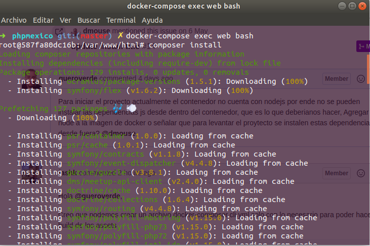
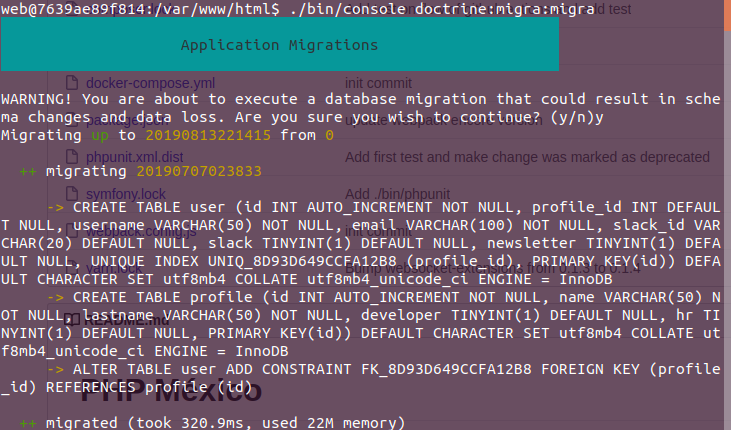
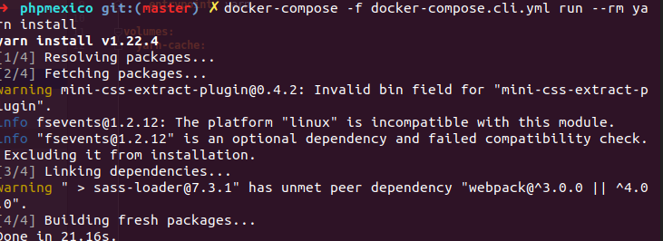
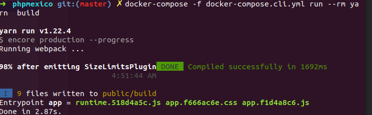
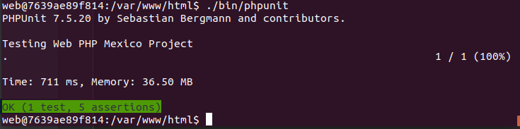

# PHP México

## Install using Docker

Usando docker-compose:

`docker-compose up -d`

`docker-compose exec -u web web bash`

and run composer install

also you can run 

`./bin/console doctrine:migra:migra`

after that you can exit of the container 

`exit`

install javascript dependencies 

`docker-compose -f docker-compose.cli.yml run --rm yarn install`

and build 

`docker-compose -f docker-compose.cli.yml run --rm yarn build`

and after that you can access to Url 

Visit http://localhost:8080

## test

access to container

`docker-compose exec -u web web bash`

and run 

`./bin/phpunit`

