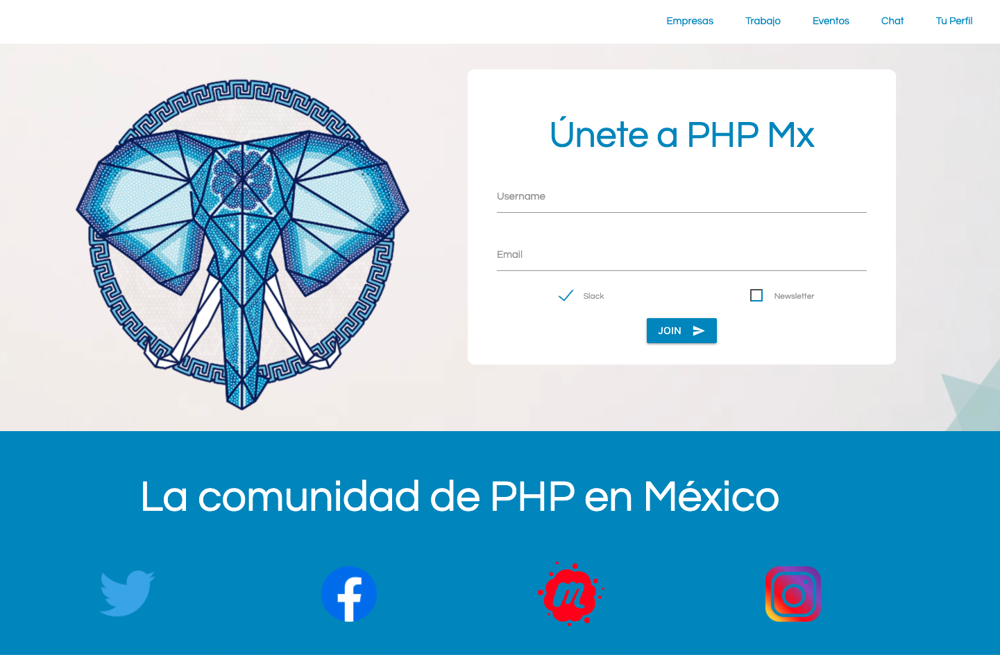

# PHP México
![php73-badge]
> PHP México Community website



## Development setup

Windows, OS X & Linux::

## Run project

- Run docker container
```sh
docker-compose up -d
docker-compose exec -u web web bash
```

- Install dependencies
```bash
composer install -o
yarn install
```

- run migrations
```bash
bin/console doctrine:migra:migra
```

- Build assets
```sh
yarn install
yarn build
```

- Go to http://localhost:8080/

## Contributing

### Open [issues](https://github.com/phpmx/phpmexico/issues) & [projects](https://github.com/phpmx/phpmexico/projects/)

1. Fork it (<https://github.com/phpmx/phpmexico/fork>)
2. Create your feature branch (`git checkout -b feature/fooBar`)
3. Run php-cs-fixer (`composer lint`)
4. Run tests (`./bin/phpunit`)
4. Commit your changes (`git commit -am 'Add some fooBar'`)
5. Push to the branch (`git push origin feature/fooBar`)
6. Create a new Pull Request

## Meta

PHP México – [@phpmx](https://twitter.com/phpmx) – [slack://phpmx](https://phpmx.slack.com)

<!-- Markdown link & img dfn's -->
[php73-badge]: https://img.shields.io/badge/PHP_Version-7.3-darkgreen.svg
